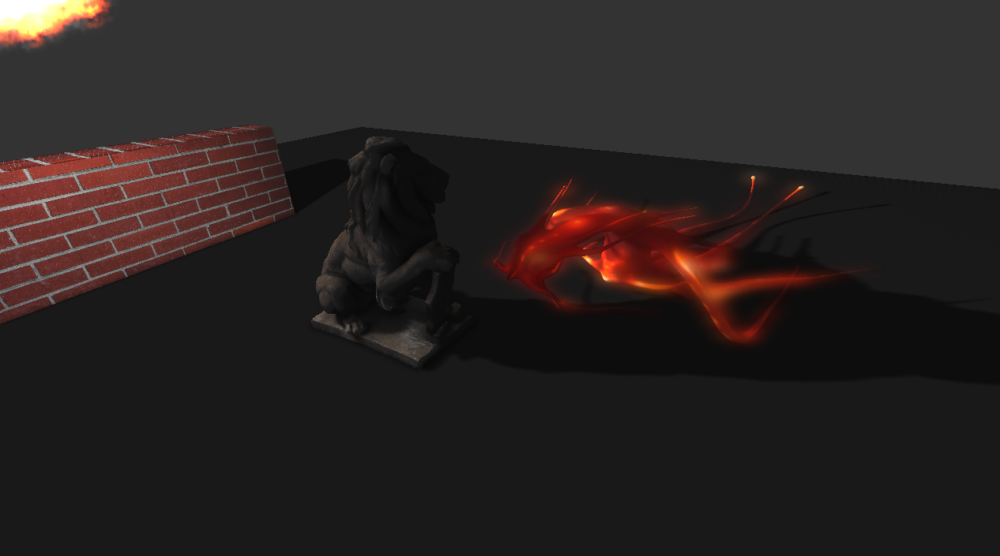

# vulkan_graphics_step1
Hello Triangle with Vulkan

Please none that this sample in fact contains 2 samples: 

* The 'master' branch with rendering to window using glfw
* The 'offscreen' that render triangle to texture and save it to image
